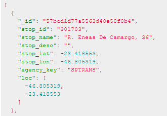
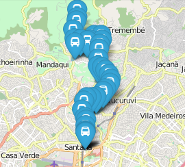
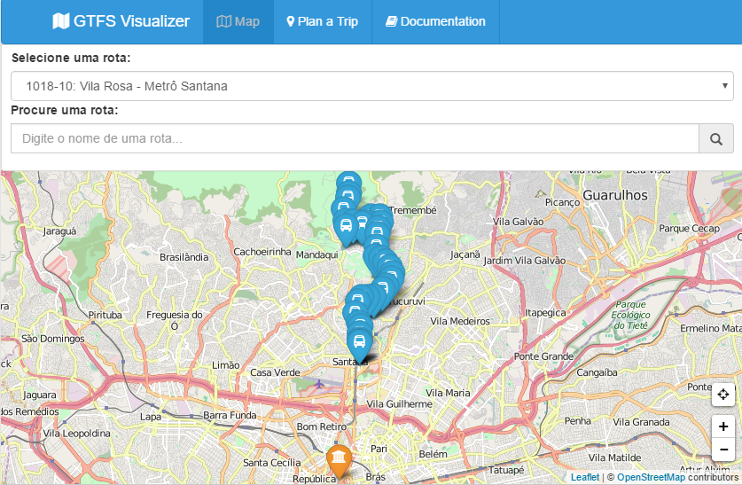

# GTFS Visualizer
======       
Data viewer for gtfs

| Before        | After         |
| ------------- |:-------------:|
|  |  |

## Functions
### Agencys
  - **Draw Agency Stop**: Draws a point on the map, with the position and agency name.
  ```javascript
  Generator.drawAgencyStop(data);
  ```



